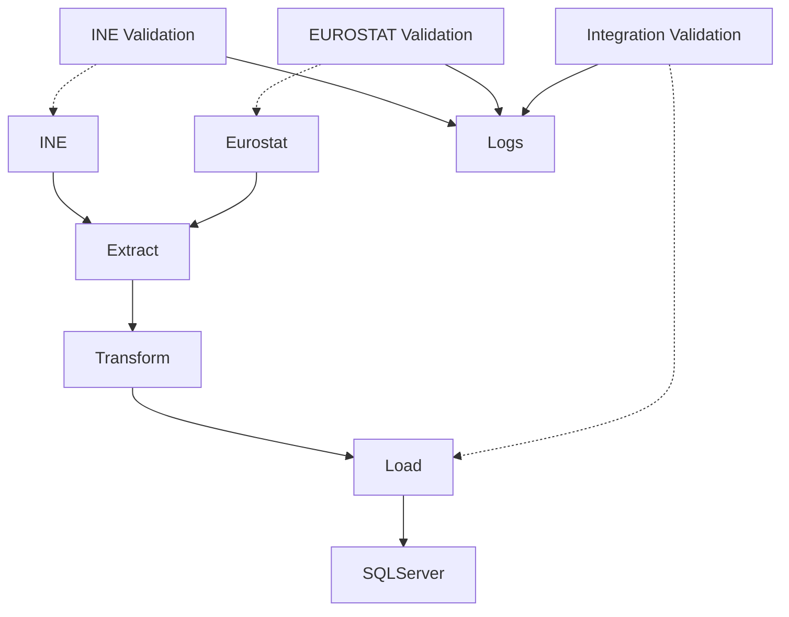
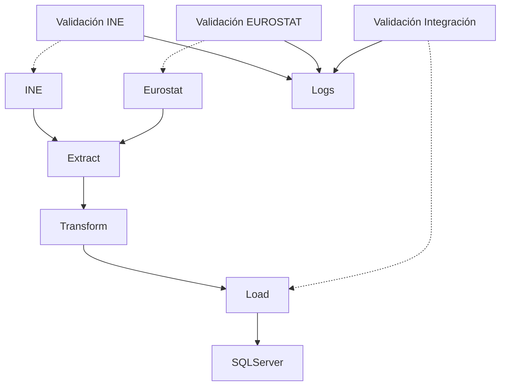

# End-to-End Data Engineering Pipeline: Social Inequality in Spain

[](https://www.python.org/)
[](https://github.com/features/actions)
[](https://flake8.pycqa.org/en/latest/)
[]()

[🇺🇸 English](#-english-version) | [🇪🇸 Español](#-versión-en-español)

---

## 🇺🇸 English Version

> **Overview:** Production-grade modular ETL pipeline designed for ingestion, transformation, and validation of socioeconomic data (INE and EUROSTAT). The project simulates a real business environment prioritizing robustness, data quality, and DevOps automation.

### 🧠 Engineering & Architecture Decisions

This project is not just a data science script; it is an implementation of software engineering applied to data.

#### 1. ⚙️ Modular & Resilient ETL Architecture

The system strictly decouples responsibilities to ensure maintainability and testability:



**Key Design Points:**
**Modular Validation:**
- Validation is performed in specific notebooks:
  - `02a_validacion_INE.ipynb`: validates INE tables according to declarative rules.
  - `02b_validacion_EUROSTAT.ipynb`: validates EUROSTAT tables according to declarative rules.
  - `02c_validacion_integracion.ipynb`: validates coherence between INE and EUROSTAT sources.
- Reports are saved in `data/validated/logs/` and do not affect the original load.
- Tables are not automatically validated upon upload; the process is explicit and modular.

#### 2. 🛠 Advanced DevOps & CI/CD (GitHub Actions)

Continuous integration pipeline designed for hybrid environments with enterprise robustness:

- **Matrix Testing:** ODBC drivers dynamically installed on **Ubuntu** and **Windows Server**.
- **Secret & Environment Management:** Conditional logic to adapt execution based on the environment.
- **Mandatory Quality Gates:**
  - `Black` – PEP 8 Formatting
  - `Flake8` – Linting
  - `MyPy` – Static Typing
  - `Pytest` – Unit Tests

#### 3. 🔒 Security & Connectivity

- **ODBC Driver 18:** Compatibility with OpenSSL 3 (Ubuntu 24.04 / Azure).
- **Encryption in Transit:** Use of `TrustServerCertificate` and secure connection string configuration.
- **Secret Management via GitHub Actions + .env**

### 🧰 Tech Stack

| Area | Tools |
|------|-------|
| **Language** | Python 3.11+ (Pandas, NumPy, PyODBC, Requests) |
| **Orchestration & CI** | GitHub Actions (Matrix Strategy) |
| **Database** | SQL Server (Azure/Local), T-SQL |
| **Quality & Testing** | Pytest, Flake8, Black, MyPy, Validation Framework |
| **Infrastructure** | Docker (optional), virtual environments |

### 📁 Project Structure

```text
desigualdad_social_etl/
├── .github/workflows/           # 🤖 CI/CD Pipelines (Matrix testing, Linting)
├── src/                         # 🧠 Modular business logic
│   ├── extractors/              # Connectors to APIs (Eurostat) and files (INE)
│   ├── loaders/                 # Idempotent load to SQL Server
│   ├── utils/                   # Transversal utilities
│   └── validation_framework.py  # Custom validation engine
├── notebooks/                   # 📓 ETL and analysis
│   ├── 00_etl/                  # Ingestion and transformation pipelines
│   ├── 01_analisis_nacional/    # Data Science
│   └── 06_sintesis/             # Executive reports
├── tests/                       # ✅ Unit and integration tests
├── docs/                        # 📚 Technical and functional documentation
├── scripts/                     # 🔧 Maintenance scripts
└── requirements.txt             # 📦 Dependencies
```

### ⚡ Quick Start

#### 1. Environment Setup

```bash
# Clone and activate environment
git clone https://github.com/your-user/Desigualdad-Espana.git
cd Desigualdad-Espana
python -m venv venv
source venv/bin/activate  # Windows: venv\Scripts\activate
pip install -r requirements.txt
```

#### 2. Environment Variables (`.env`)

```env
DB_CONNECTION_STRING="DRIVER={ODBC Driver 18 for SQL Server};SERVER=localhost;DATABASE=desigualdad;Trusted_Connection=yes;TrustServerCertificate=yes;"
```

> **Note:** Double quotes around the connection string help preserve special characters when exporting the variable in different shells.

#### 3. Pipeline Execution

```bash
# Full Execution (E-T-L)
python notebooks/00_etl/01_run_etl.py

# Data Validation
python notebooks/00_etl/02_run_validation.py
```

### 📊 Impact & Results

The pipeline processes and consolidates **30 analytical tables** with critical indicators (AROPE, Gini, CPI).
**99.5%** coherence guaranteed between national (INE) and European (Eurostat) sources.

📌 More details in:
`docs/DICCIONARIO_DATOS.md`

### 📬 Contact

This project demonstrates real capabilities of **Data Engineering + Data Quality + CI/CD**.

**Author:** Mario
**Focus:** Data Engineering, Data Quality, DevOps

---
---

## 🇪🇸 Versión en Español

> **Visión General:** Pipeline ETL modular de nivel productivo diseñado para ingesta, transformación y validación de datos socioeconómicos (INE y EUROSTAT). El proyecto simula un entorno empresarial real priorizando la robustez, la calidad del dato y la automatización DevOps.

### 🧠 Ingeniería y Decisiones de Arquitectura

Este proyecto no es solo un script de ciencia de datos; es una implementación de ingeniería de software aplicada a datos.

#### 1. ⚙️ Arquitectura ETL Modular y Resiliente

El sistema desacopla estrictamente las responsabilidades para garantizar mantenibilidad y testabilidad:



**Puntos clave del diseño:**
**Validación Modular:**
- La validación se realiza en notebooks específicos:
  - `02a_validacion_INE.ipynb`: valida tablas INE según reglas declarativas.
  - `02b_validacion_EUROSTAT.ipynb`: valida tablas EUROSTAT según reglas declarativas.
  - `02c_validacion_integracion.ipynb`: valida coherencia entre fuentes INE y EUROSTAT.
- Los reportes se guardan en `data/validated/logs/` y no afectan la carga original.
- No se valida automáticamente todas las tablas al subir datos; el proceso es explícito y modular.

#### 2. 🛠 DevOps y CI/CD Avanzado (GitHub Actions)

Pipeline de integración continua diseñado para entornos híbridos con robustez empresarial:

- **Matrix Testing:** Drivers ODBC instalados dinámicamente en **Ubuntu** y **Windows Server**.
- **Gestión de secretos y entornos:** Lógica condicional para adaptar la ejecución según entorno.
- **Quality Gates obligatorios:**
  - `Black` – Formateo PEP 8
  - `Flake8` – Linting
  - `MyPy` – Tipado estático  
  - `Pytest` – Tests unitarios

#### 3. 🔒 Seguridad y Conectividad

- **ODBC Driver 18:** Compatibilidad con OpenSSL 3 (Ubuntu 24.04 / Azure).
- **Encriptación en tránsito:** Uso de `TrustServerCertificate` y configuración segura de cadena de conexión.
- **Gestión de secretos vía GitHub Actions + .env**

### 🧰 Stack Tecnológico

| Área | Herramientas |
|------|---------------|
| **Lenguaje** | Python 3.11+ (Pandas, NumPy, PyODBC, Requests) |
| **Orquestación & CI** | GitHub Actions (Matrix Strategy) |
| **Base de Datos** | SQL Server (Azure/Local), T-SQL |
| **Calidad & Testing** | Pytest, Flake8, Black, MyPy, Validation Framework |
| **Infraestructura** | Docker (opcional), entornos virtuales |

### 📁 Estructura del Proyecto

```text
desigualdad_social_etl/
├── .github/workflows/           # 🤖 CI/CD Pipelines (Matrix testing, Linting)
├── src/                         # 🧠 Lógica de negocio modular
│   ├── extractors/              # Conectores a APIs (Eurostat) y ficheros (INE)
│   ├── loaders/                 # Carga idempotente a SQL Server
│   ├── utils/                   # Utilidades transversales
│   └── validation_framework.py  # Motor de validación custom
├── notebooks/                   # 📓 ETL y análisis
│   ├── 00_etl/                  # Pipelines de ingesta y transformación
│   ├── 01_analisis_nacional/    # Ciencia de datos
│   └── 06_sintesis/             # Informes ejecutivos
├── tests/                       # ✅ Tests unitarios e integración
├── docs/                        # 📚 Documentación técnica y funcional
├── scripts/                     # 🔧 Scripts de mantenimiento
└── requirements.txt             # 📦 Dependencias
```

### ⚡ Quick Start

#### 1. Preparación del entorno

```bash
# Clonar y activar entorno
git clone https://github.com/tu-usuario/Desigualdad-Espana.git
cd Desigualdad-Espana
python -m venv venv
source venv/bin/activate  # Windows: venv\Scripts\activate
pip install -r requirements.txt
```

#### 2. Variables de Entorno (`.env`)

```env
DB_CONNECTION_STRING="DRIVER={ODBC Driver 18 for SQL Server};SERVER=localhost;DATABASE=desigualdad;Trusted_Connection=yes;TrustServerCertificate=yes;"
```

> **Nota:** las comillas dobles alrededor de la cadena de conexión ayudan a preservar caracteres especiales al exportar la variable en distintos shells.

#### 3. Ejecución del Pipeline

```bash
# Ejecución completa (E-T-L)
python notebooks/00_etl/01_run_etl.py

# Validación de datos
python notebooks/00_etl/02_run_validation.py
```

### 📊 Impacto y Resultados

El pipeline procesa y consolida **30 tablas analíticas** con indicadores críticos (AROPE, Gini, IPC).
Se garantiza una coherencia del **99.5%** entre fuentes nacionales (INE) y europeas (Eurostat).

📌 Más detalles en:
`docs/DICCIONARIO_DATOS.md`

### 📬 Contacto

Este proyecto demuestra capacidades reales de **Data Engineering + Data Quality + CI/CD**.

**Autor:** Mario
**Enfoque:** Ingeniería de Datos, Calidad del Dato, DevOps

---

## 📄 Licencia

Este proyecto es de código abierto y está disponible bajo la licencia **MIT**.
